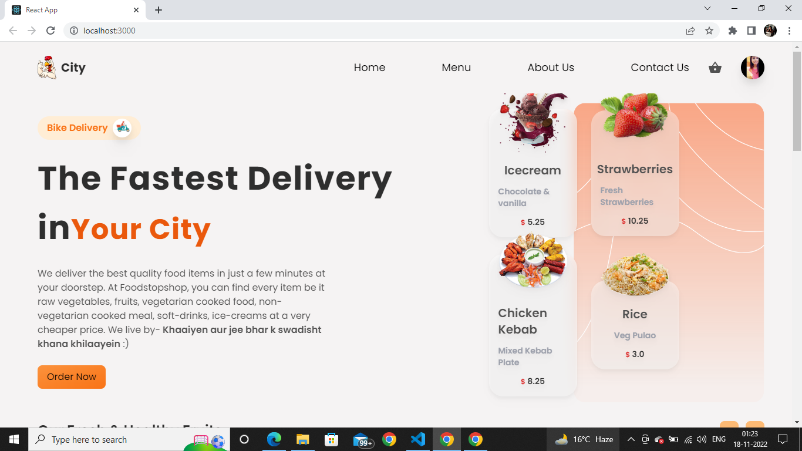
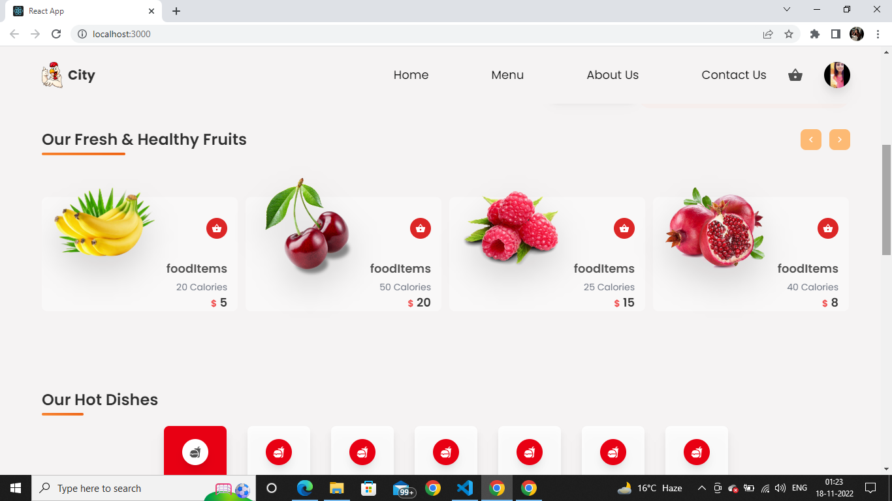
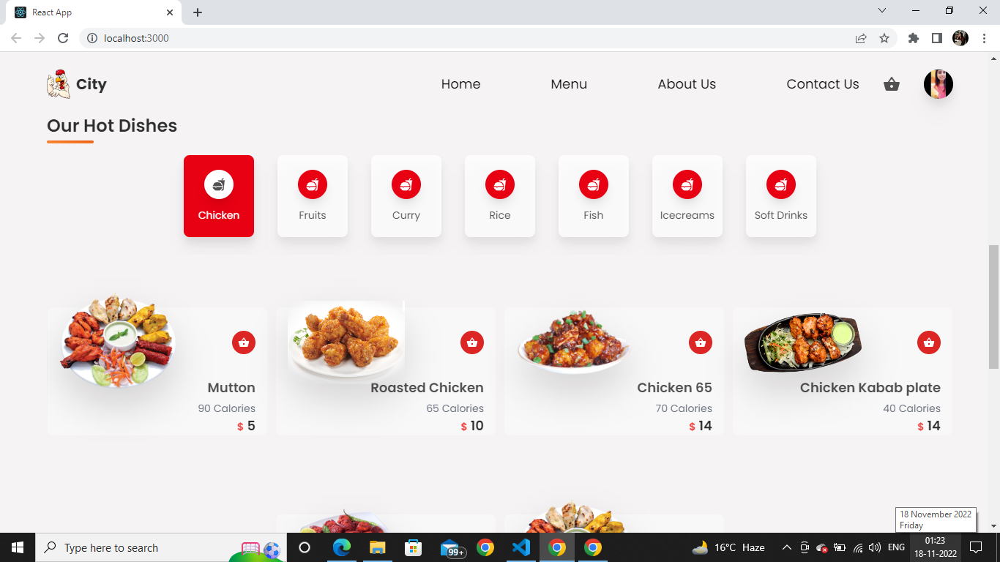
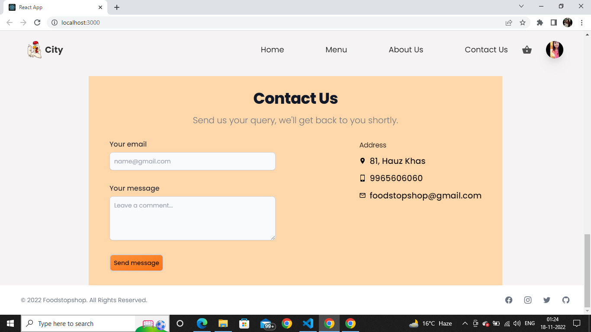

# Foodstopshop 
* This is a Food Delivery website. 
* In this website, the customers can find every different category of the food items be it raw fruits, vegetables, vegetarian cooked meal, non vegetarian cooked meal, soft drinks and the dessert too.
* It is built using React.js and Tailwind Css.
* It is a responsive website.

## Features of the Website
* It has a header section displaying the 4 different links which redirects the user to the specific part of the website and a Cart along with the profile section of the customer. The customer can login to his account.
* It has Create item feature using, only the shop owner can add new items in the website using that.
* It has a Carousel. The customer can scroll in the left and right direction using it.
* The customer can add any likable item to the cart. 
* Clicking on the cart, it shows all the added items along with the total price. The customer can increase and decrease the items there too.
* It has a checkout page, after adding all the details, a customer can place an order.
* The user can also logout from the website.
* It has a Contact Us Section.
* It also has a footer.

### Landing Page

### Menu(1) Page

### Menu(2) Page

### Contact Us and Footer Page

## To run the website...
1. Download and extract the code.
2. Open in an IDE (preferably VS Code)
3. Open a Terminal and write the following command:
  - npm start

*The website will run in your default browser automatically after the last step.*

